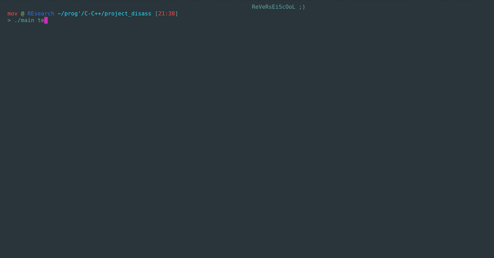

# Paragon Disassembler

Just a simple binary analysis tool

# Installation & Utilisation

You must just run the Makefile with : 

```make```

You can choose the section that you want to disassemble : 

```Usage : ./main <elf> <section> <option>```

It's looks like that : 



# Help

```
Help : 
        -a  ->  Print all the informations on a binary
        -h  ->  Print this help
        -a <section> ->  Print the informations on the section gives in argument
        -e  -> Print the executable header only
        -sh  -> Print the section header only
        -p  -> Print the program header only
 ```
